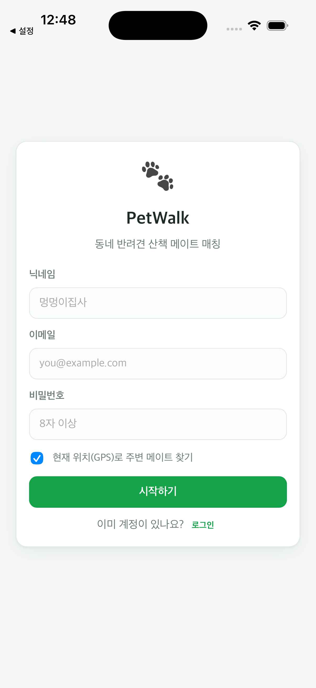
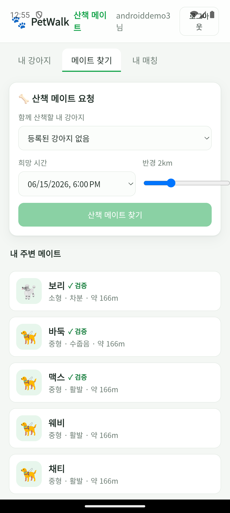

# PetWalk — 동네 반려견 산책 메이트 매칭

[](https://github.com/yuneunmi814-cmyk/petwalk/actions/workflows/ci.yml)

반경 2km 내 검증된 견주를 매칭해 함께 산책할 메이트를 연결하는 위치 기반 앱.
[PlanForge](../planforge)가 생성한 설계 문서(`planforge/samples/01-petwalk-design.md`)를
그대로 구현한 **build-ready 스펙 → 실제 동작 앱** 예제다.

스택: **React + TypeScript (Vite)** · **FastAPI** · **SQLAlchemy 2.0** · JWT(Access/Refresh) ·
Bcrypt · AES-256-GCM · 로컬은 SQLite(프로덕션은 PostgreSQL + PostGIS로 교체).

---

## 핵심 설계 포인트 (설계 문서 §1~§8 대응)

- **위치 프라이버시** — 정확 GPS는 서버에만 저장하고, 클라이언트에는 **~300m 격자(grid cell)의
  중심 좌표만** 반환한다. 어떤 응답에도 `home_lat/home_lng`가 포함되지 않는다
  (`tests/test_location_privacy.py`로 강제).
- **비동기 매칭** — 산책 요청은 `202 + jobId`로 즉시 반환하고, 적합도 계산(거리·견종 크기·성향
  궁합·시간대 겹침)은 백그라운드 워커가 처리한다. UI는 진행률을 폴링해 보여준다.
- **안전** — 첫 만남은 **공개 장소 목록**에서만 선택 가능. 신고 1회로 **양방향 즉시 차단**되어
  매칭 후보에서 제외된다(재요청 차단).
- **통일된 에러 계약** — 모든 실패는 `{"error":{"code","message"}}`, 상태코드는
  400/401/403/404/409/429/500로 제한. 인증 트래픽은 사용자별 레이트 리밋(429 + Retry-After).
- **Soft Delete & 제약** — 강아지/요청은 `deleted_at`, `reviews(match,rater)`·`users.email` UNIQUE.

### 구현 범위 (MVP)

프로필 · 위치(격자) · 메이트 탐색 · 비동기 요청/수락 · 채팅 · 후기 · 신고/차단 · 관리자 지표.
WebSocket 실시간 채팅, PostGIS 공간쿼리, Redis 캐시/큐, 결제는 설계 문서의 v1/v2 단계로
의도적으로 미룬 부분이며, 코드 구조는 그 교체를 전제로 분리돼 있다.

---

## 실행

### Docker (한 줄, 권장)

```bash
docker compose up --build
# 웹   http://localhost:8080   (nginx가 SPA 서빙 + /api 프록시)
# API  http://localhost:8200/docs
```

직접 실행하려면 — 전제: **Python 3.12+**, **Node 18+**. 백엔드 `:8200`, 프론트 `:5173`(Vite 프록시 `/api` → `:8200`).

### 1) 백엔드

```bash
cd backend
python3 -m venv .venv
source .venv/bin/activate
pip install -r requirements-dev.txt
uvicorn app.main:app --port 8200      # 첫 기동 시 데모 견주 + 공개 장소 자동 시드
```

### 2) 프론트엔드

```bash
cd frontend
npm install
npm run dev                            # http://localhost:5173
```

회원가입 시 **“강남 데모 위치로 설정”**을 켜면 시드된 주변 메이트가 바로 보인다.
데모 계정 로그인: `jihu@demo.example.com` 외 / 비밀번호 `demo1234`.

### 테스트

```bash
cd backend && source .venv/bin/activate
pytest                                 # 29 passed — 인증/CRUD/비동기매칭/WebSocket채팅/프라이버시/신고차단/단위
```

---

## 모바일 앱 (iOS · Android)

웹과 **동일한 React 코드**를 [Capacitor](https://capacitorjs.com)로 감싸 네이티브 iOS·Android 앱으로
빌드한다. 네이티브에서는 데모 위치 대신 **실제 GPS**(`@capacitor/geolocation`)를 쓰고, 채팅은 그대로
WebSocket으로 동작한다.

```bash
cd frontend
# 1) 디바이스에서 닿는 백엔드 주소로 웹 자산 빌드
#    iOS 시뮬레이터: localhost · Android 에뮬레이터: 10.0.2.2 · 실기기: LAN IP/배포 URL
VITE_API_BASE=http://localhost:8200 npm run build
npx cap sync

# 2) iOS — Xcode 필요
npx cap open ios          # Xcode에서 Run, 또는:
xcodebuild -project ios/App/App.xcodeproj -scheme App -sdk iphonesimulator build

# 3) Android — Android SDK + JDK 17/21 필요
npx cap open android      # Android Studio에서 Run, 또는:
( cd android && ./gradlew assembleDebug )   # → app/build/outputs/apk/debug/app-debug.apk
```

- `appId` `com.petwalk.app`. 위치 권한 문구(iOS Info.plist)·권한(Android Manifest)·dev 클리어텍스트·mixed-content(Android) 설정 포함.
- 백엔드 CORS가 Capacitor 오리진(`capacitor://localhost`, `http(s)://localhost`)을 허용.

### 실제 구동 검증

iPhone 17 시뮬레이터와 Pixel 7 에뮬레이터에 실제 설치·구동했다. Android는 에뮬레이터 GPS를 강남으로
설정해 **가입 → 백엔드(`10.0.2.2:8200`) → 주변 메이트 로드**까지 확인(아래 오른쪽).

| iOS — 가입 화면 (네이티브 GPS 라벨) | Android — 가입 후 홈 (실데이터) |
|:---:|:---:|
|  |  |

### 릴리스 빌드 (Android)

서명 설정은 `android/keystore.properties`(gitignore)에서 읽는다.

```bash
cp android/keystore.properties.example android/keystore.properties   # 값 채우기
keytool -genkeypair -v -keystore android/petwalk-release.keystore -alias petwalk -keyalg RSA -keysize 2048 -validity 10000
( cd android && ./gradlew assembleRelease bundleRelease )
#  → app-release.apk (서명됨, 4.4MB) · app-release.aab (Play Console 업로드용, 4.1MB)
```

APK 서명 검증 완료(V2 Signer, `CN=PetWalk`). **iOS 릴리스**는 Apple Developer 계정($99/년) + Xcode 서명이 필요.

---

## 구조

```
backend/
  app/
    core/        config · database · errors(통일 계약) · security(bcrypt·JWT·AES·grid) · ratelimit · deps
    models.py    users·dogs·walk_requests·match_jobs·matches·messages·reviews·reports·blocks·meeting_places
    schemas.py   camelCase 와이어 모델 (정확 좌표 미노출)
    routers/     auth · dogs · mates · walk_requests · matches · reviews · reports · places · admin
    services/    matching(비동기 적합도 워커) · seed(데모 데이터)
  tests/         pytest (in-process, 임시 파일 SQLite)
frontend/
  src/
    api.ts       토큰 저장 + 타입드 fetch/WS 클라이언트 (VITE_API_BASE로 웹·네이티브 전환)
    location.ts  네이티브 GPS(@capacitor/geolocation) · 데모 좌표 폴백
    tabs/        DogsTab · FindTab(요청→진행률→매칭→수락) · MatchesTab(WebSocket 채팅·후기·신고)
    App.tsx      인증 + 셸 + 탭
  capacitor.config.ts   appId com.petwalk.app
  ios/ android/         Capacitor 네이티브 프로젝트 (cap add 생성, 빌드 검증 완료)
```

> 분산 모델(Tauri 사이드카로 로컬 백엔드 번들)은 [PlanForge](../planforge)와 동일 패턴으로 확장 가능.
